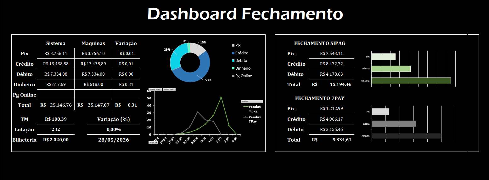

# Automação de Fechamento de Caixa

Este módulo do portfólio contém uma solução automatizada para o processo de fechamento financeiro diário e conciliação de vendas de cartões de duas ou mais maquinas de cartão de diferentes provedores.

---

## Acesso ao Arquivo

 **[Clique aqui para baixar a planilha diretamente (`Planilha_de_automacao_de_fechamento.xlsb.xlsx`)](./Planilha_de_automacao_de_fechamento.xlsb.xlsx)**

---

## O "Motor" por trás do Projeto

A parte principal desse projeto não é o visual e sim a arquitetura ao qual foi feito:

1. **Camada de ETL (Power Query):** Em vez de colagem manual de dados, o Power Query atua como o motor que se conecta aos relatórios `.csv` brutos extraídos diretamente dos sistemas das adquirentes.
2. **Tratamento de Dados:** Filtros automáticos tratam inconsistências, limpam registros vazios ou inuteis e padronizam formatos de data e hora.
3. **Regras de Negócio Otimizadas:** Automação do cálculo de taxas operacionais e valores líquidos, cruzando os dados do sistema interno com o que foi processado pelas máquinas de cartão.

Este projeto teve como objetivo automatizar um processo financeiro que antes era executado de forma 100% manual e repetitiva. Além do alto consumo de tempo operacional,
a atividade gerava vulnerabilidade a erros humanos de digitação e conciliação, o que estendia ainda mais o tempo gasto com retrabalho e auditoria dos resultados.
Com a implementação da nova arquitetura automatizada, o processo de fechamento — que antes demandava um tempo desnecessário — agora é concluído em menos de 1 minuto. Além disso, em casos de incongruências nos dados,
o diagnóstico e a resolução de problemas (que antes levavam horas de busca manual) passaram a ser identificados e mitigados em poucos minutos através dos alertas visuais do painel.

## O Dashboard 

A aba principal foi desenhada seguindo alguns padrões modernos de Design de Interface (UI):
* **Fundo limpo e sem linhas de grade** para reduzir a poluição visual. Nada que tire o foco dos números e indicadores.
* **Cards tridimensionais isolados** para destacar os KPIs mais importantes (Faturamento Bruto, Taxas Totais e Divergências).
* Gráficos interativos integrados para analíse e tomada de decisão ágil do gestor.

---
🔄 *Este projeto serve de base para a Versão 2, onde toda essa lógica de Power Query será migrada para scripts em Python, banco de dados PostgreSQL e relatórios dinâmicos no Power BI.*
