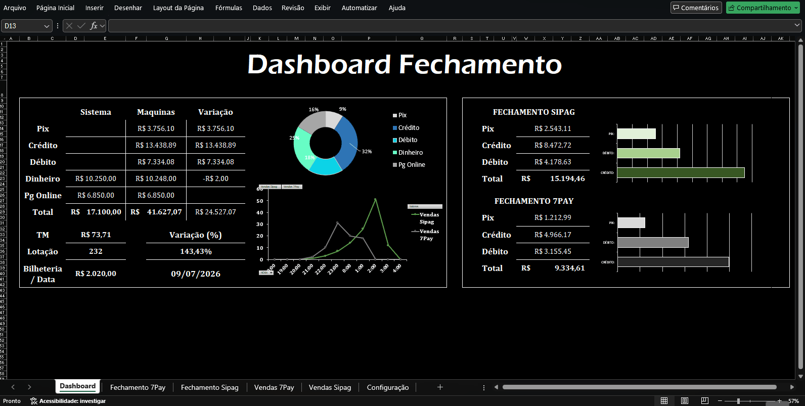
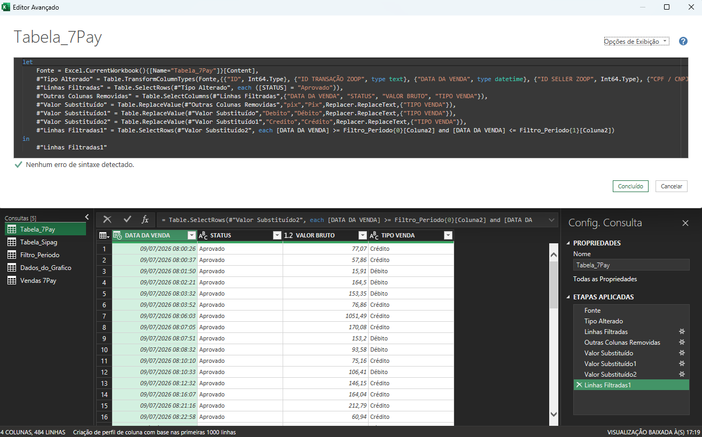
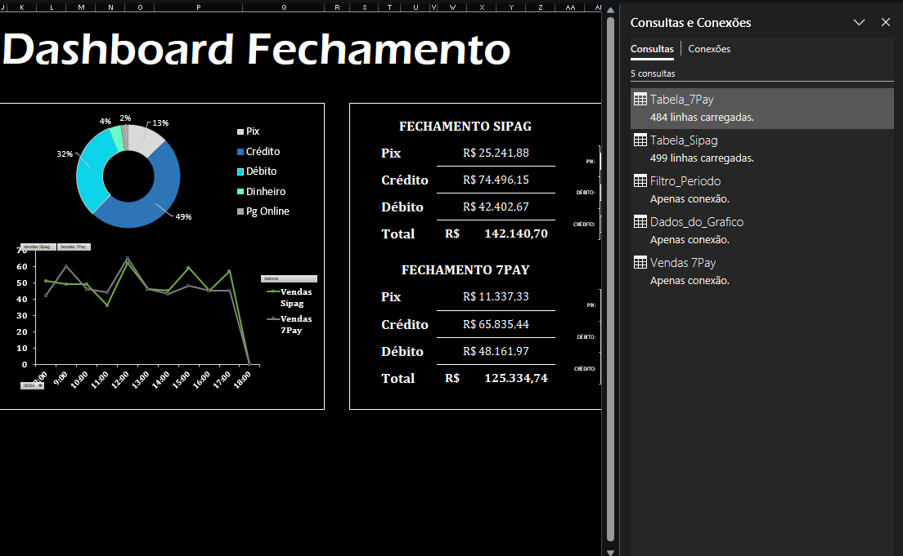
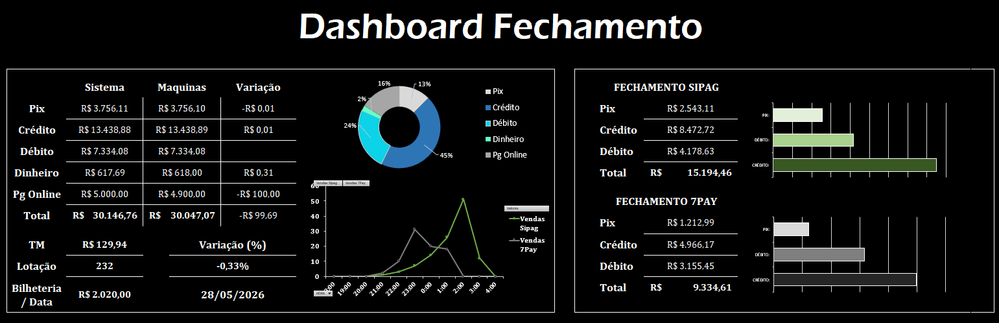

# 💳 POS Reconciliation Automation (Excel + Power Query)

Automated solution for the daily financial closing and card sales reconciliation process across two or more card machines from different acquirers, built entirely in **Excel + Power Query**.

> ⚠️ **Note on the data**: all sales values, dates, and volumes shown in this project (spreadsheet, screenshots, and videos) are **fictitious**, generated solely for demonstration purposes. No real customer, transaction, or revenue data is exposed.

---

## 🎯 The Problem

Cash closing used to be a **100% manual** process: copying values from each card machine, comparing them against the internal system, typing in differences, and putting together the day's report. Besides the operational time spent, this routine was prone to **human errors in data entry and reconciliation**, which extended the time spent on rework and results auditing even further.

## ✅ The Solution

With automation via Power Query, the closing process — which used to take a considerable amount of time every day — is now completed in **under 1 minute**. Discrepancies between the system and the machines, which used to require hours of manual digging, are now automatically identified and flagged directly on the dashboard.



---

## 🏗️ Project Architecture

The core of this project isn't the visuals — it's the architecture behind it:

```
Raw CSV (acquirer)  →  Native Excel Table  →  Power Query (ETL)  →  Dashboard
   (7Pay / Sipag)        (Vendas 7Pay/Sipag)     (cleaning + rules)     (KPIs)
```

1. **ETL Layer (Power Query)**: instead of manual pasting, Power Query connects to the source tables and processes the data extracted from the acquirers' systems.
2. **Data Handling**: automatic filters remove empty/useless records, standardize naming ("pix" → "Pix", "Debito" → "Débito", etc.), and format dates/times.
3. **Business Rules**: automatic calculation of discrepancies between the internal system's value and the value settled by the machines, with error handling (`IFERROR`) and rounding to eliminate Excel's floating-point noise.
4. **Dynamic Parameters**: a configuration table (`Filtro_Periodo`) defines the closing's date range, used by every query — just change two cells to reprocess everything.



---

## 🔄 How to Import New Data

One of the core points of this automation is that **updating the closing report requires no manual formulas** — just pasting the new data and refreshing. The flow is:

1. Download the day's report exported from the acquirer's portal (7Pay or Sipag), usually in `.csv` format.
2. Open the exported file and copy only the **data rows** (without the header row).
3. Paste those rows right below the last row of the corresponding table — `Tabela_7Pay` in the *Vendas 7Pay* sheet, or `Tabela_Sipag` in the *Vendas Sipag* sheet. Since these are native Excel Tables, they automatically expand to include the new rows.
4. Go back to the Dashboard and click **Data → Refresh All** (or `Ctrl+Alt+F5`).
5. All queries (`Filtro_Periodo`, `Tabela_7Pay`, `Tabela_Sipag`, `Dados_do_Grafico`) are automatically reprocessed and the dashboard updates with the new figures — without typing anything manually.

---

## 📊 Spreadsheet Structure

| Sheet | Function |
|---|---|
| `Dashboard` | Visual panel with KPIs, charts, and System x Machines comparison |
| `Vendas 7Pay` / `Vendas Sipag` | Native tables where the raw exported data is loaded |
| `Fechamento 7Pay` / `Fechamento Sipag` | Data already processed by Power Query, ready for the Dashboard |
| `Configuração` | Analysis period parameters (`Filtro_Periodo`) and auxiliary data for the hourly chart |



---

## 🎨 The Dashboard

The main tab was designed following modern UI standards:

- Clean background with no gridlines, to reduce visual clutter and keep the focus on the numbers.
- Isolated cards to highlight the most important KPIs (revenue by payment method, average ticket, discrepancies).
- Interactive charts (payment-method breakdown donut chart + hourly sales line chart) for quick reading of the day's behavior.



---

## 🛠️ Technologies

`Excel` · `Power Query (M)` · `Power Pivot`

---

## 📂 File Access

[Click here to download the spreadsheet](https://github.com/Glauber9/FG-Portfolio/blob/main/automacao-fechamento-excel/Planilha_de_automacao_de_fechamento.xlsx)

---

## 🚀 Next Steps (V2)

This project serves as the foundation for **Version 2**, to be developed and released later, where all the logic currently implemented in Power Query will be migrated to:

- **Python** scripts for the ETL
- **PostgreSQL** database
- Dynamic reports in **Power BI**
