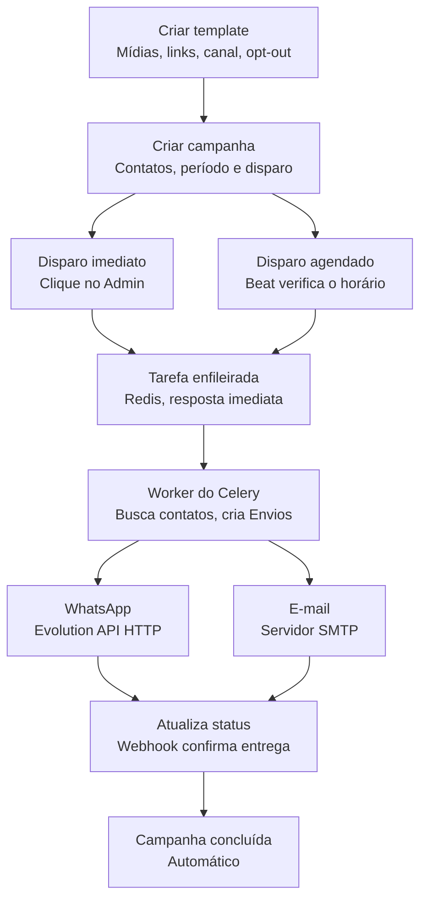
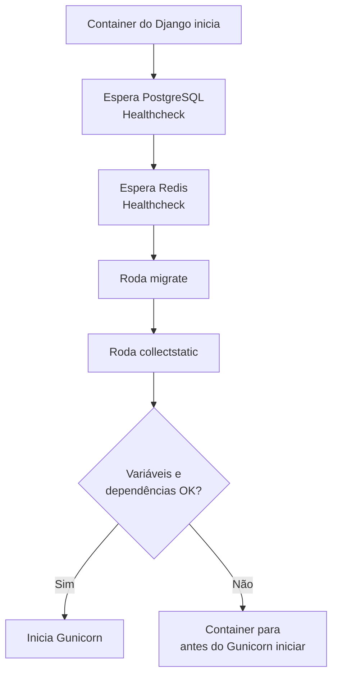

# Campanhas de Mensagens

Este projeto foi desenvolvido para o disparo de campanhas de mensagens em massa via WhatsApp e e-mail.


---

## Índice
 
- [Sobre o projeto](#sobre-o-projeto)
- [Tecnologias utilizadas](#tecnologias-utilizadas)
- [Fluxograma de Disparo de Campanhas](#fluxograma-de-disparo-de-campanhas)
- [Capturas de tela](#capturas-de-tela)
- [Considerações técnicas importantes](#considerações-técnicas-importantes)
- [Configuração do ambiente (local e produção)](#configuração-do-ambiente-local-e-produção)
- [Estrutura de diretórios](#estrutura-de-diretórios)
- [Importação de contatos](#importação-de-contatos)
- [Contato e contribuição](#contato-e-contribuição)
---
 
## Sobre o projeto
 
Foi elaborado para o envio de campanhas personalizadas de mensagens via WhatsApp e/ou e-mail, possui opções para envio de mídias (imagem ou vídeo) e links junto às campanhas. É possível também criar grupos específicos de contatos selecionados a depender da campanha, agendar e configurar o período em que as mensagens serão enviadas. A arquitetura é construída sobre 7 tecnologias open-source — Django, Celery, PostgreSQL, Redis, Nginx, Evolution API e Docker Compose — orquestradas em containers dentro de uma rede Docker isolada funcionando todas em conjunto como em uma cadeia. O projeto também conta com arquivos de configuração dedicados, que separam claramente os ambientes de desenvolvimento e produção. 
 
 
## Tecnologias utilizadas

São sete peças. Cada uma resolve um problema bem específico da arquitetura, e no fim elas se encaixam de um jeito que evita duplicar responsabilidade.

O núcleo é o , com o **Django Admin** personalizado pelo [Unfold](https://github.com/unfoldadmin/django-unfold) para aprimorar a estética. Por questões de praticidade optei por essa ferramenta em vez de construir um front-end do zero, deixei o Django gerar a interface administrativa automaticamente a partir dos models, e troquei o visual padrão — que já está bem datado — pelo tema em Tailwind do Unfold, com dashboard customizável. Não existe front-end separado. Cadastro de contatos, templates, criação e disparo de campanhas, relatórios: tudo acontece ali dentro.

Para o processamento assíncrono entra o , com *worker* e *beat* rodando separados. A ideia é simples: nada que demore — como disparar uma campanha inteira — pode travar o usuário esperando na tela. O worker consome três filas dedicadas (`celery`, `whatsapp`, `email`), cada uma com seu próprio limite de taxa, pra não estourar o rate limit do WhatsApp ou do provedor de e-mail. Enquanto o beat cuida da agenda: verifica periodicamente as campanhas programadas e fecha automaticamente as que terminaram.

Por baixo de tudo isso tem um , guardando contatos, campanhas, templates, envios, os agendamentos do próprio Celery e o resultado das tasks. A Evolution API usa essa mesma instância de banco, mas em um schema isolado — os dados não se misturam.

O  faz dois papéis ao mesmo tempo: é o broker que carrega as mensagens de tarefa entre Django e Celery, e também serve de cache do Django — uso, por exemplo, no rate limiting de alguns endpoints mais sensíveis.

Na frente de tudo tem o , a única porta de entrada do sistema. Ele decide, pela URL, se a requisição vai pros arquivos estáticos (servidos direto do disco, sem passar pelo Django), pro Django/Gunicorn, ou pros containers da Evolution API.

E a  é a peça que conecta esse mundo todo ao WhatsApp de verdade: um projeto open-source que expõe o protocolo do WhatsApp Web como uma API REST. O worker manda uma requisição HTTP pra ela e ela repassa a mensagem; do lado inverso, avisa o sistema via webhook quando uma mensagem é entregue, lida, ou quando alguém responde.

Por fim,  e **Docker Compose** orquestram os 7 serviços numa rede isolada. Tem healthcheck garantindo a ordem certa de inicialização, e Docker Secrets pra nunca deixar credencial em texto puro no `docker-compose.yml`.
No Docker, os serviços sobem juntos com `docker-compose`, em ordem:
 
1. **PostgreSQL** e **Redis** iniciam primeiro.
2. O **Django** espera os dois ficarem prontos (healthcheck).
3. O Django roda **migrações** e coleta **arquivos estáticos**.
4. O **Gunicorn** inicia a aplicação.
5. O **Celery worker** e o **Celery beat** entram depois que o Django está saudável.
6. O **Nginx** entra por último e aponta para o Django.
> Se o Django falhar no boot, os serviços que dependem dele ficam presos em `unhealthy`.
 
---
 
## Fluxograma de disparo de campanhas

Para disparar uma campanha, o usuário primeiro precisa criar um template de mensagem na área "Campanhas". É ali que se definem as possíveis mídias ou links que vão junto com a mensagem, se ela terá o link de descadastro, e por qual canal será enviada — WhatsApp, e-mail ou ambos. Depois disso, o usuário cria a campanha em si, definindo quais contatos vão recebê-la, o período de envio e a forma como ela será iniciada: agendada ou disparada na hora.

Quando é imediata, o usuário seleciona a campanha no Admin e clica em "Disparar campanhas selecionadas". Quando é agendada, o horário fica definido junto ao período, e nesse caso é o *beat* do Celery quem fica de olho, checando periodicamente se chegou a hora de alguma campanha programada. Os dois caminhos desembocam no mesmo lugar: o Django enfileira a tarefa `iniciar_campanha` no Redis e responde na hora, sem ficar esperando o envio de verdade acontecer.

Dali pra frente quem assume é o worker do Celery. Ele pega a tarefa, busca no Postgres os contatos elegíveis pra aquela campanha, calcula os horários de envio considerando o delay configurado — pra não disparar tudo de uma vez só — e cria um registro de `Envio` pra cada combinação de contato e canal.

Quando chega o horário marcado, o worker processa o envio de fato: se for WhatsApp, chama a Evolution API por uma requisição HTTP interna; se for e-mail, conecta direto num servidor SMTP. A Evolution API confirma o recebimento da mensagem e, mais tarde, avisa via webhook quando ela é entregue ou lida — é nesse momento que o Django atualiza o status daquele envio no banco.

A campanha é marcada como concluída sozinha, sem nenhuma ação manual, assim que todos os seus envios saem do estado "pendente".


---
 
## Capturas de tela
 
> Adicione aqui prints/gifs reais do projeto rodando. Sugestões do que capturar:
 
**Dashboard inicial (Unfold)**
``
*Visão geral com KPIs de campanhas em andamento, envios do dia e taxa de sucesso.*
 
**Relatório agrupado de envios**
``
*Status de WhatsApp e e-mail lado a lado por contato, com os ícones de status (✓, ✓✓, lido).*
 
**Criação de campanha**
``
*GIF mostrando a seleção de grupos/contatos, template e janela de envio.*
 
**Painel da Evolution API (conexão do WhatsApp)**
``
*Tela de QR Code e status da instância conectada.*
 
**Importação de contatos via CSV/XLSX**
``
 
---
 
## Considerações técnicas importantes

**A versão de produção roda num servidor privado, não em uma plataforma gerenciada.** Diferente de serviços tipo Heroku ou Vercel, que geram uma URL pública automaticamente no deploy, aqui a aplicação sobe num servidor próprio (VPS ou servidor dedicado) — não existe domínio pronto. É necessário registrar um domínio e apontar o registro DNS dele (A ou CNAME) para o IP público desse servidor. O Nginx, que já funciona como porta de entrada do sistema, é quem recebe as requisições feitas a esse domínio e as distribui entre Django, arquivos estáticos e Evolution API. Sem esse apontamento, os containers continuam rodando normalmente dentro do servidor, mas ficam inacessíveis de fora — e qualquer funcionalidade que dependa de URL pública, como o link de opt-out abaixo, simplesmente não funciona.

**O opt-out exige um domínio (ou servidor) publicamente acessível.** Cada mensagem enviada carrega um link único de descadastro (`{{link_opt_out}}`), montado a partir de `PUBLIC_BASE_URL` mais um token. Esse link precisa ser alcançável pelo aparelho de quem recebeu a mensagem — ou seja, `localhost` não funciona para esse fluxo específico fora da sua própria máquina. Rodando localmente, dá pra testar tudo *menos* o clique real do link a partir de um celular. Em produção, isso exige no mínimo um domínio (dinâmico ou fixo) apontando para o servidor, e recomenda-se HTTPS — além de necessário para segurança, evita que o link seja sinalizado como suspeito pelo WhatsApp ou por filtros de e-mail.
 
**Evolution API vs. API oficial da Meta.** A Evolution API usa o protocolo do WhatsApp Web (engenharia reversa, não oficial) — permite rodar de graça, self-hosted, sem aprovação prévia da Meta, mas com risco real de bloqueio do número se o volume ou a velocidade de envio for muito agressivo. É por isso que existe um delay aleatório entre as mensagens: numa campanha agendada para um período de envio, o sistema calcula sozinho o tempo de delay necessário para enviar todas as mensagens dentro do período definido — mas cabe ao usuário ter o cuidado de não programar uma quantidade grande demais de envios pra um período muito curto, pra não correr risco de banimento.
 
Essa escolha por uma tecnologia open-source também trouxe uma limitação: a ideia inicial era ter um botão interativo de descadastro (quick reply) direto na mensagem, mas esse recurso só existe na API oficial da Meta, a WhatsApp Business Platform (Cloud API). Ela exige verificação de negócio e cobra por conversa, mas em troca oferece estabilidade muito maior e recursos nativos como os botões interativos — o que tornaria o opt-out um botão real de "Descadastrar" dentro da conversa, em vez de um link de texto. Migrar para a API oficial é o caminho natural caso o projeto vire produto de verdade. Caso alguém queira usar este projeto com a API oficial e explorar essa funcionalidade, é só entrar em contato comigo — fico à disposição para fornecer as adaptações necessárias.
 
---

## Configuração do ambiente (local e produção)

O projeto usa os mesmos arquivos em qualquer ambiente — o que muda entre local e produção está concentrado em quatro lugares: variáveis de ambiente, configuração do Nginx, override do Docker Compose e dependências Python.

| O que muda | Local (dev) | Produção |
|---|---|---|
| Variáveis de ambiente | `.env.dev` → `.env` | `.env.producao` → `.env` |
| Configuração do Nginx | `nginx/nginx.dev.conf` | `nginx/nginx.conf` |
| Compose | `docker-compose.yml` (sozinho) | `docker-compose.yml` + `docker-compose.prod.yml` |
| Dependências Python | `requirements.dev.txt` | `requirements.txt` |

**O que não muda entre ambientes:** models, migrations, tarefas do Celery, views, URLs da aplicação, estrutura dos apps, lógica de negócio.

### 1. Escolher e copiar o `.env`

```bash
cd disparo-mensagens
cp .env.dev .env   # ambiente local
# ou
cp .env.prod .env  # ambiente de produção
```

Você pode manter dois arquivos `.env` distintos e trocar de um pro outro, ou manter um único `.env` e editar os valores manualmente conforme o ambiente. `DJANGO_DEBUG=True` só deve ser usado no ambiente local.

**Local:**

```env
DJANGO_ALLOWED_HOSTS=localhost,127.0.0.1
CSRF_TRUSTED_ORIGINS=http://localhost:8000
EVOLUTION_INSTANCE_NAME=minha-instancia
POSTGRES_DB=disparo_db
POSTGRES_USER=disparo_user
POSTGRES_HOST=disparo_postgres
POSTGRES_PORT=5432
REDIS_HOST=disparo_redis
REDIS_PORT=6379
```

**Produção** — o restante das variáveis (host do Postgres, do Redis etc.) permanece igual, já que se referem aos nomes dos serviços dentro da própria rede do Docker Compose:

```env
DJANGO_DEBUG=False
DJANGO_ALLOWED_HOSTS=seudominio.com
CSRF_TRUSTED_ORIGINS=https://seudominio.com
PUBLIC_BASE_URL=https://seudominio.com
ENVIRONMENT=production
SENTRY_DSN=https://sua-dsn-do-sentry
```

`PUBLIC_BASE_URL` é a variável mais sensível dessa lista: é ela que monta o link de descadastro enviado nas mensagens. Se ficar como `localhost`, o opt-out não funciona fora da sua própria máquina — veja mais em [Considerações técnicas importantes](#considerações-técnicas-importantes).

`DJANGO_SECRET_KEY` e `POSTGRES_PASSWORD` não entram no `.env` — ficam nos Docker Secrets, fora de qualquer arquivo versionado.

### 2. Onde editar cada coisa

- Debug, hosts permitidos, domínio, chaves de API → arquivo `.env` (copiado de `.env.dev` ou `.env.producao`).
- Exposição de porta do Django, ou qual arquivo de Nginx é montado → `docker-compose.prod.yml`.
- Rotas e proxy do Nginx em si (ex: domínio do Evolution API Manager) → `nginx/nginx.conf` em produção, `nginx/nginx.dev.conf` em dev.

**O que o `docker-compose.prod.yml` sobrescreve**, especificamente:
- `disparo_django.ports` vira `[]` — remove a exposição da porta 8000 direto pro host. Em produção só o Nginx fica acessível de fora; o Django passa a ser alcançado exclusivamente através dele.
- `disparo_nginx.volumes` troca o `nginx/nginx.dev.conf` pelo `nginx/nginx.conf` — a configuração real usada em produção.

### 3. Subir os containers

Local:

```bash
docker-compose up -d
```

Produção — como `docker-compose.prod.yml` é só um override, todo comando do Compose precisa dos dois arquivos juntos (up, down, restart, exec, logs, não importa qual). Rodar sem o `-f docker-compose.prod.yml` faz o Compose enxergar só a configuração base, que reabre a porta 8000 do Django direto pro host e volta a montar o `nginx.dev.conf`:

```bash
docker-compose -f docker-compose.yml -f docker-compose.prod.yml up -d
```

Pra não digitar isso toda vez, vale criar um alias no servidor:

```bash
alias dc-prod="docker-compose -f docker-compose.yml -f docker-compose.prod.yml"
# uso: dc-prod up -d / dc-prod logs -f disparo_django
```

### 4. Verificar se subiu

```bash
docker-compose ps
docker-compose logs -f disparo_django
```

### 5. Acessar a aplicação

| Serviço | URL |
|---|---|
| Django Admin | http://localhost/pt-br/admin/ |
| Evolution API Manager | http://manager.localhost/manager/ |

Em produção, `localhost` e `manager.localhost` são substituídos pelo domínio real apontado no `.env` — por exemplo, `https://seudominio.com/pt-br/admin/` e `https://manager.seudominio.com/manager/`.

### Ordem prática antes de subir

1. Escolha o ambiente: dev ou produção.
2. Copie o arquivo certo para `.env` (ou edite manualmente, se optar por manter um único arquivo).
3. Confira os valores de `DJANGO_DEBUG`, hosts e URLs.
4. Rebuild as imagens se alterou dependências ou Dockerfile.
5. Suba os containers com o comando do ambiente certo (lembre do `-f docker-compose.prod.yml` em produção).
6. Olhe o log do Django se algo falhar.

---

## Segredos

| Arquivo | Uso |
|---|---|
| `secrets/` | Arquivos locais com senhas e chaves sensíveis, usados pelo Docker Secrets |

O `.env` guarda apenas configuração **não sensível** — hosts, portas e flags de ambiente. Senhas e chaves ficam em arquivos dentro de `secrets/`, montados pelo Docker Compose:

- `secrets/postgres_password`
- `secrets/redis_password`
- `secrets/django_secret_key`
- `secrets/authentication_api_key`
- `secrets/evolution_webhook_secret`
- `secrets/email_host_password`

---
## Estrutura de diretórios
 
```
disparo-mensagens/
disparo-mensagens/
├── app/
│   ├── campanhas/
│   ├── contatos/          
│   ├── envios/            
│   ├── config/
│   ├── templates/admin/
│   ├── logs/
│   ├── media/
│   ├── staticfiles/      
│   ├── Dockerfile
│   ├── entrypoint.sh
│   ├── manage.py
│   └── requirements.txt
├── nginx/
├── secrets/
├── docker-compose.yml
├── docker-compose.prod.yml
└── .env
```
 
### Fluxo de execução

O arquivo `app/entrypoint.sh` faz a sequência de inicialização do Django. Ele espera o PostgreSQL e o Redis ficarem prontos, roda as migrações e coleta os arquivos estáticos antes de subir o Gunicorn. Se alguma variável obrigatória estiver faltando ou se uma dependência não carregar em qualquer uma dessas etapas, o container para antes do Gunicorn iniciar.


 
---
 
## Importação de contatos
 
O projeto aceita importação de contatos por três caminhos:
 
- pelo admin, enviando um CSV ou XLSX;
- pela API, enviando um arquivo em `arquivo`;
- pela API, enviando uma lista JSON em `contatos` ou uma URL remota em `url`.
**Endpoint:** `POST /contatos/api/importar/`
 
**Exemplo com arquivo local:**
 
```bash
curl -X POST http://localhost:8000/contatos/api/importar/ \
	-H "Authorization: Token SEU_TOKEN" \
	-F "arquivo=@contatos.xlsx"
```
 
**Exemplo com lista JSON:**
 
```bash
curl -X POST http://localhost:8000/contatos/api/importar/ \
	-H "Authorization: Token SEU_TOKEN" \
	-H "Content-Type: application/json" \
	-d '{
		"contatos": [
			{"nome": "Ana", "telefone": "5511999999999", "email": "ana@exemplo.com"},
			{"nome": "Bruno", "telefone": "5511888888888", "email": "bruno@exemplo.com", "ativo": true}
		]
	}'
```
 
**Exemplo com URL remota:**
 
```bash
curl -X POST http://localhost:8000/contatos/api/importar/ \
	-H "Authorization: Token SEU_TOKEN" \
	-H "Content-Type: application/json" \
	-d '{"url":"https://exemplo.com/contatos.xlsx"}'
```
 
**Resposta típica:**
 
```json
{
	"status": "ok",
	"resumo": {
		"criados": 10,
		"atualizados": 2,
		"ignorados": 0,
		"erros": [],
		"total": 12
	}
}
```
---
 
## Contato e contribuição

Projeto pessoal, desenvolvido para fins de estudo e portfólio. Sugestões, issues e pull requests são bem-vindos.

- **Autor:** _Felipe Glauber_
- **E-mail (Gmail):** _fglauberca_
- **LinkedIn:** _[linkedin.com/in/felipe-glauberca](https://www.linkedin.com/in/felipe-glauberca)_
